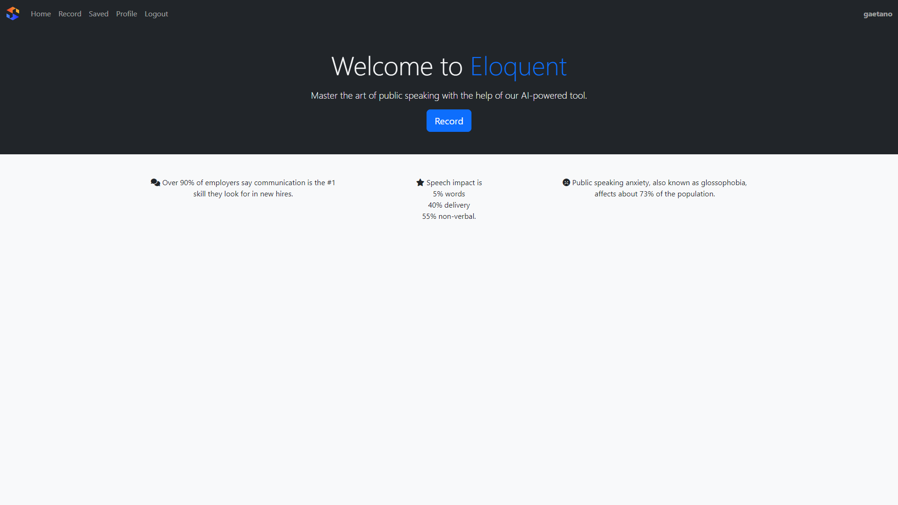
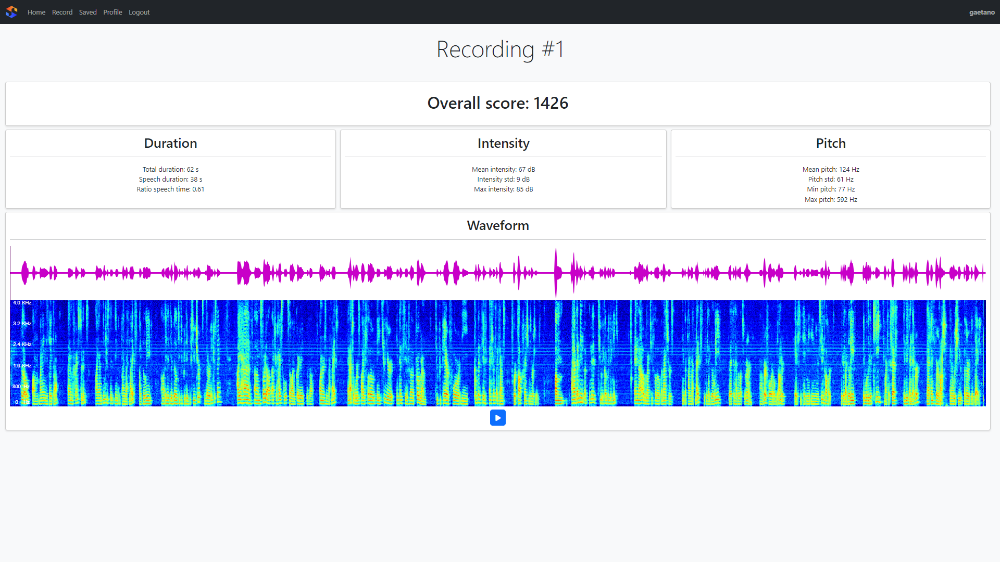
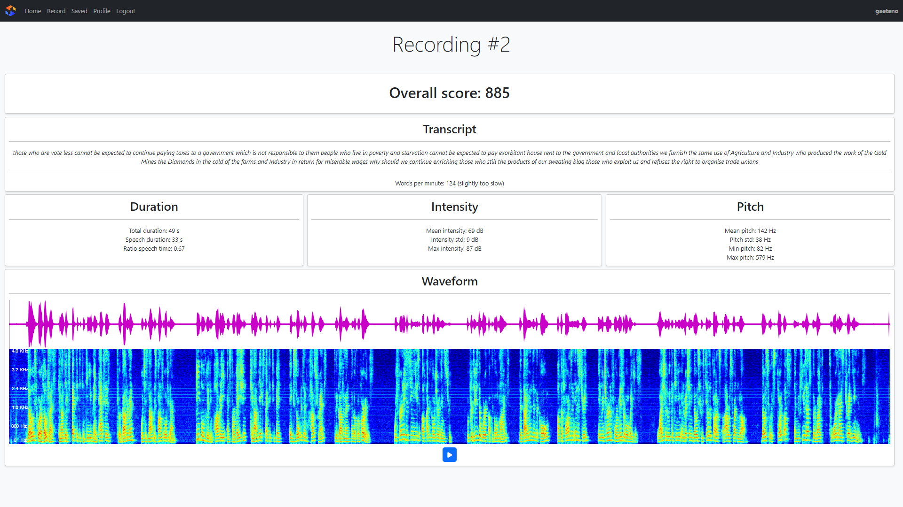
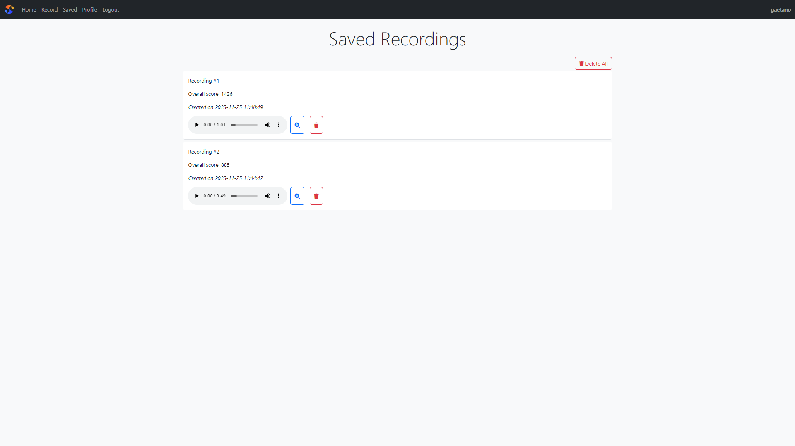

# This is a very short demo using screenshots of what eloquent can do.

## Home Page

## Record Page

## Recording #1 (without transcript)

## Recording #2 (with US English transcript)

## Saved Recordings

